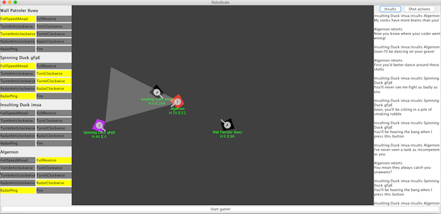

# Assignment 3 

For assignment 3, we're going to implement a game played by AI.
The puzzle is not, however, in building brilliant AI, but in using Actors and Reactive Streams.

The game we're going to implement is based on *RoboCode*, an IBM DeveloperWorks game for learning programming.

A lot of the code has been written for you. As this assignment comes out near the
end of the unit, it is a combination of example and assignment: there are parts you 
need to write, but also just by working with the code that is written for you, you
will encounter and work with Actor and ReactiveStream code.

### RoboScala


Each AI pilots a robotic tank on a virtual battlefield. 
Each tank has a body, a turret, and a radar. The radar is
mounted on top of the turret.

The tanks do not know where each other is, unless they detect
them with their radar. The radar has a cone of vision that you
can see in the UI. 

Each tank also has a health level and an energy level.
Energy replenishes from the power plant; the
radar (when it is pinged), and the gun (when it is fired) use power. 

### What's written for you

As the assignment is about Actors, much of the game is already
written for you. This means, for example, that you will find examples
of Actors interacting in the sample code. Implemented:

* The UI
* The classes for Tank and Shell
* GameActor, which runs the game
* InsultsActor and CommandStreamActor, used for later parts of the assignment
* A set of Commands that players can send the GameActor
* A set of InsultCommands that players can send the InsultsActor
* A set of Messages that the GameActor can reply with
* SpinningDuck, a sample tank Actor

But there is still some work for you to do -- see the tasks below.

First, though, a little about the tanks/players.
Each Player is an Actor. To define a new kind of tank AI, you'd need to define classes for them,
and have `Main` ask the actor system to create them. 
An example, `SpinningDuck` is provided. Take a look at it to see how
to work with Actors and sending messages.

When a Player is instantiated, the first thing it needs to do
is send a `Register` message to the GameActor (`Main.gameActor`)
to get its tank on the field. 

Thereafter, each game tick, it will receive a `TankState` message
with the state of the tank.

To command the tank, a tank's Actor should send messages to `Main.gameActor`.
For example

```scala
Main.gameActor ! FullSpeedAhead
```

Commands are reset after ever game tick, so to keep accelerating forward you'll
have to keep sending the command. (Though the tank can coast if you don't 
drive the engines.)


### Task 1: Write WallPatroler (10 marks)

Your first task is to write an Actor that will control a tank.
So for this task, you will find `SpinningDuck` useful as an example.

In terms of the exercise, this ensures you can:

* Write Actors
* Request the ActorSystem to create your actor (using Props)
* Receive messages
* Respond to messages

The particular tank you are asked to write should try to drive around the boundary of the field, 20 pixels in 
from the edge. (It can take rounded corners if you want -- a simple technique is to drive forwards, but check
whether a point one second's travel ahead of you is in the boundary, and if it's not, turn steer right).

It should also always try to aim its turret and radar towards the center of the field. It should ping the radar
whenever energy is full (at `Tank.startingEnergy`), and fire whenever a RadarResult message shows it has seen
a tank that is alive.

It should be called `WallPatroler`, so the marker knows which tank to look for.

Note that `turretFacing` will give you the direction the turret 
is facing (taking into account the tank's orientation and the angle
of the turret with respect to the tank's body). The radar is mounted
on the turret, so if you don't turn the radar, it will stay pointed in
whatever direction the turret is facing.

Marking:

* WallPatroler is on the field: 2 marks (means you've created an actor)
* WallPatroler moves: 2 marks (means your actor is sending messages in response to TankState messages)
* WallPatroler patrols the border: 2 marks
* WallPatroler points its turret towards the centre: 2 marks
* WallPatroler fires when it sees an enemy: 2 marks


### Task 2: Write your own tank (12 marks)

To make the game more interesting, we'd like *you* to write a tank of your own design.

Your tank should have two states: *Patrolling* when it is looking for a target to attack and *Attacking(t)* when it
has found a target and is trying to defeat it.

You should include a short description of your tank's strategy in the
comments.

Your tank should be called `MyVeryOwnTank` so the marker knows which tank
to look for.

Marking:

* Tank patrols: 3 marks
* Tank targets and attacks tanks: 3 marks
* Quality of strategy in the comments: 3 marks
* Quality of strategy implementation: 3 marks


### Task 3: Tankfighting with Insults (6 marks)

*So, imagine we're fighting up a storm, when suddenly there's a lull
in the action. And then I says "Soon, you'll be sitting in a pile of smoking rubble." 
And so you says...*

This part of the assignment is inspired by a famous part of 
*The Secret of Monkey Island*, but will get you to use `Future`s 
 and the ask pattern, and integrate them with your tank's actor.

First, add `InsultingDuck` to your game (in Main):

```
actorSystem.actorOf(Props(classOf[InsultingDuck]))
```

Take a look at its code.

InsultingDuck won't try to fight normally. Instead, it will periodically send
insults via the InsultsActor. These are then sent to tanks as an `Insulted(insult)` message.
Because `InsultsActor` uses the `ask` pattern, tanks receive this from a
*temporary actor that the InsultsActor creates specifically for handling replies*. 
At the time a tank receives the message, this sender is available as `sender()`. 

The task is to alter your tank so that when it receives an insult, it fires back
a devastatingly witty retort. This needs to be a `Retort` message, with the correct
response, sent to the (temporary) actor you received the `Insulted` message from.

To do this you will need to:

* Remember the sender of the message. 
  (Because later messages might come in with a different `sender()` before you've finished replying)
* *Ask* the InsultsActor what the correct retort is for an insult, by sending it a 
  `WhatsTheRetortFor` command. Hint: yes that would be the ask pattern! 
  Double-hint: `InsultsActor` and `CommandStreamActor` both have examples of using the ask pattern.
* When it responds with the `Retort`, send it to the actor you received the
  `Insulted` message from (the sender you remembered)
  
You are also asked to *log* the insult and the retort, and to remember (and log) all
the insults you've learned so far. (So that in the future, you might be able to 
launch devastating insult attacks of your own...)

Take a look at `InsultsActor` for how to do logging in Actors

Marking: 

* Logs insults when it receives them (1 mark)
* Gets the retort from the InsultsActor and logs it (2 marks)
* Successfully sends the retort to the right actor (2 marks)
* Remembers the set of unique insults it's heard and logs them (1 mark)


### Task 3: Reactive streams of commands (2 marks)

`CommandStreamActor` is an actor that all tank commands are sent to.

On the right hand side of the Game UI is `GameUI.messagesTextArea`, which can show
the most recent 15 tank commands that have been flowing through the game. (With the
exception that it doesn't print some of the minor commands.)

`CommandStreamActor` accepts a `RegisterStreamSink(sink)` message, for registering an Akka Streams
sink to listen to all the commands. 

However, `GameUI` is currently missing the code needed to register a Sink and actually
listen into the messages:

```scala
def register() = {
    // TODO: you need to implement this!
    // Send Main.commandStreamActor a RegisterStreamSink message, with a Sink that will call pushCommand(tank, command)
  }
```

You need to implement this method. Your Sink should receive each `(tank, command)` tuple
that is sent on the stream, and call `pushCommand` with the data to push it inot the message display.


